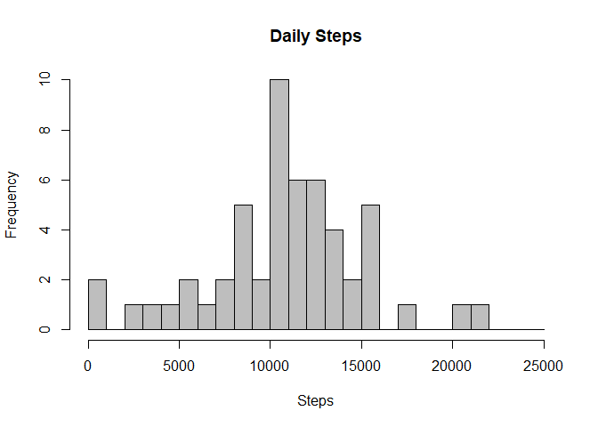
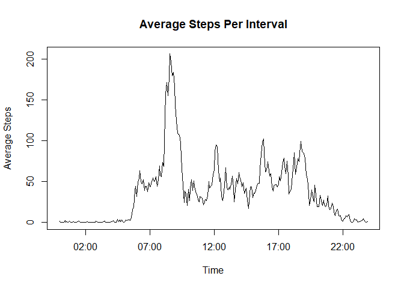
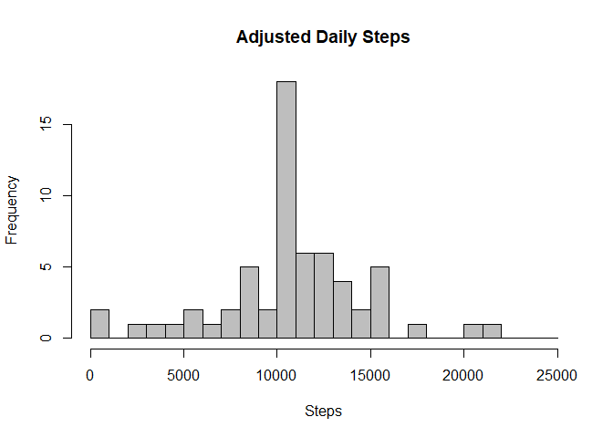
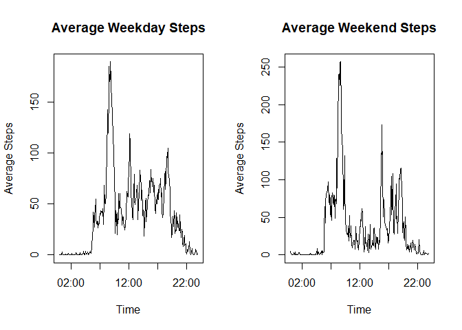

Analysis of Personal Activity Data
==================================

Introduction
------------

The data being analyzed is a the number of footsteps taken by an
individual collected at 5 minute intervals over the course of October
and November, 2012.

    activity_data<-read.csv("activity.csv")
    summary(activity_data)

    ##      steps                date          interval     
    ##  Min.   :  0.00   2012-10-01:  288   Min.   :   0.0  
    ##  1st Qu.:  0.00   2012-10-02:  288   1st Qu.: 588.8  
    ##  Median :  0.00   2012-10-03:  288   Median :1177.5  
    ##  Mean   : 37.38   2012-10-04:  288   Mean   :1177.5  
    ##  3rd Qu.: 12.00   2012-10-05:  288   3rd Qu.:1766.2  
    ##  Max.   :806.00   2012-10-06:  288   Max.   :2355.0  
    ##  NA's   :2304     (Other)   :15840

Extracting Daily Total
----------------------

The data is classified by date, using which we can extract the daily
totals and summary stats and daily means and medians, and then providing
a histogram.

    dates<-activity_data[,2]
    daily_totals<-as.vector((by(activity_data$steps,dates,sum)))
    hist(daily_totals,main="Daily Steps",xlab="Steps",col="grey",border="black",breaks = seq(from=0,to=25000,by=1000))

    clean_daily_totals<-(daily_totals[!is.na(daily_totals)])
    ## Median
    median(clean_daily_totals)

    ## [1] 10765

    ## Mean
    mean(clean_daily_totals)

    ## [1] 10766.19

Removing NAs and Creating a Time Series
---------------------------------------

    no_nas<-activity_data[-which(is.na(activity_data$steps)),]
    interval_averages<-as.vector(by(no_nas$steps,no_nas$interval,mean))

    times<-as.POSIXlt(seq(ymd_hm("2000-01-01 00:00"),ymd_hm("2000-01-01 23:55"),by='5 mins'))

    time_series_plot_data<-data.frame(times,interval_averages)
    plot(time_series_plot_data,ylab="Average Steps",xlab="Time",main="Average Steps Per Interval",type="l")

    time_series_plot_data$times<-strftime(time_series_plot_data$times,format="%H:%M")
    time_series_plot_data[which.max(time_series_plot_data$interval_averages),]

    ##     times interval_averages
    ## 104 03:35          206.1698

Replacing the NAs
-----------------

    clean_activity_data<-activity_data
    Interval_Average<-rep(interval_averages,61)
    clean_activity_data<-cbind(clean_activity_data,Interval_Average)
    clean_activity_data$steps[is.na(clean_activity_data$steps)]<-clean_activity_data$Interval_Average[is.na(clean_activity_data$steps)]

    adjusted_daily_totals<-as.vector(by(clean_activity_data$steps,dates,sum))
    hist(adjusted_daily_totals,main="Adjusted Daily Steps",xlab="Steps",col="grey",border="black",breaks = seq(from=0,to=25000,by=1000))

    ## Median
    median(adjusted_daily_totals)

    ## [1] 10766.19

    ## Mean
    mean(adjusted_daily_totals)

    ## [1] 10766.19

Weekdays vs Weekends
--------------------

    day<-as.factor(weekdays(as.POSIXct.Date(clean_activity_data$date)))
    clean_activity_data2<-cbind(clean_activity_data,day)
    Day_Index<-c("Monday","Tuesday","Wednesday","Thursday","Friday","Saturday","Sunday")
    Weekday_Index<-c("Weekday","Weekday","Weekday","Weekday","Weekday","Weekend","Weekend")
    clean_activity_data2$weekday_weekend<-Weekday_Index[match(clean_activity_data2$day,Day_Index)]
    weekday_weekend<-as.factor(clean_activity_data2$weekday_weekend)

    weekday_data<-subset(clean_activity_data2,weekday_weekend=="Weekday")
    weekday_intervals<-as.vector(by(weekday_data$steps,weekday_data$interval,mean))
    weekday_plot_data<-data.frame(times,weekday_intervals)
    weekend_data<-subset(clean_activity_data2,weekday_weekend=="Weekend")
    weekend_intervals<-as.vector(by(weekend_data$steps,weekend_data$interval,mean))
    weekend_plot_data<-data.frame(times,weekend_intervals)

    par(mfrow=c(1,2))
    plot(weekday_plot_data,type="l",ylab="Average Steps",xlab="Time",main = "Average Weekday Steps")
    plot(weekend_plot_data,type="l",ylab="Average Steps",xlab="Time",main = "Average Weekend Steps")

